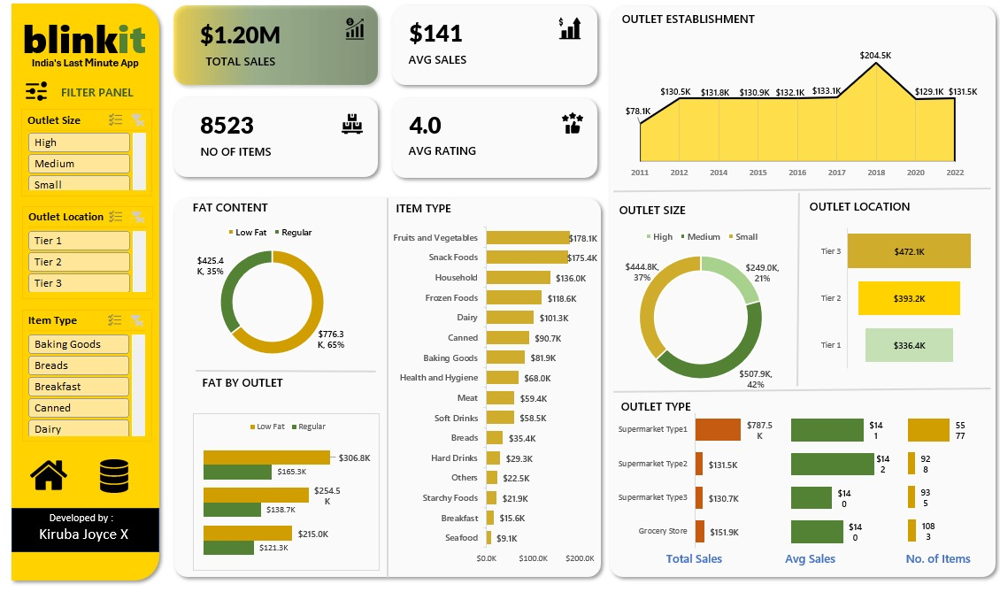

# Blinkit Sales Analysis Dashboard - Excel

## Overview

This project analyzes Blinkit sales data using Microsoft Excel to track sales performance, outlet characteristics, product categories, and customer purchasing trends.

## Tools Used

- Microsoft Excel
- Pivot Tables
- Pivot Charts
- Slicers
- Dashboard Design

## Key Metrics

- Total Sales: $1.20M
- Average Sales: $141
- Number of Items: 8523
- Average Rating: 4.0

## Dashboard Features
- Fat Content Analysis (Low Fat vs Regular)
- Fat By Outlet Comparison
- Item Type Sales Performance
- Outlet Establishment Year Trends
- Outlet Size Analysis
- Outlet Location Analysis
- Outlet Type Performance Analysis
- Interactive Slicers and Filters

## Dashboard Preview

## Files Included

- Blinkit_Sales_Dashboard.xlsx
- Blinkit-Dashboard.png
- Blinkit-Dataset.csv

## How to View

1. Download Blinkit_Sales_Dashboard.xlsx
2. Open using Microsoft Excel
3. Use slicers and filters to explore dashboard insights

## Author

Kiruba Joyce
